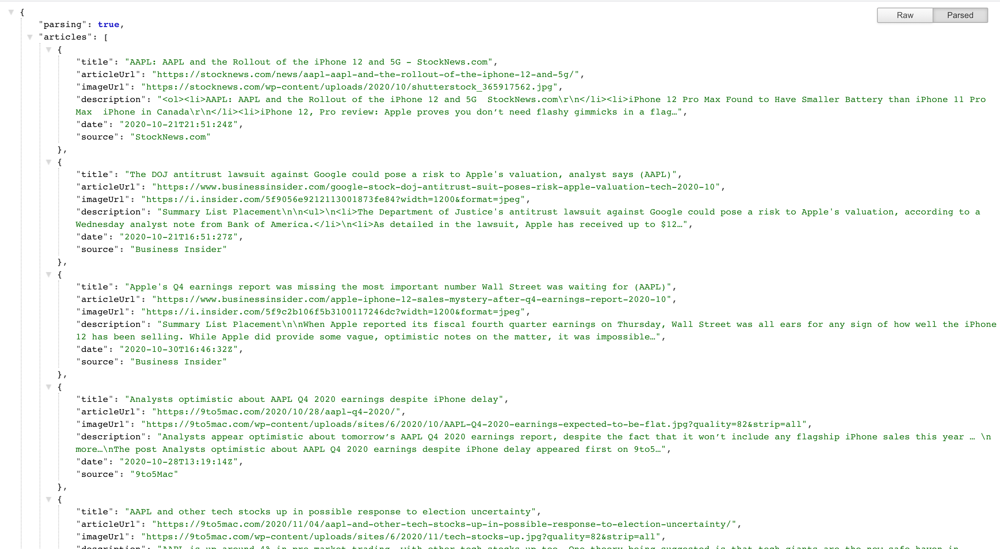

# Node, Angular and Bootstrap based Stock application (AWS)

A website developed as part of CSCI 571 - Web Technologies @ USC. This repository only contains the source code for Node javascript backend. The Angular frontend is present here: https://github.com/adityachandupatla/angular-stock-app

<h2>Project Goals</h2>
<ul>
  <li>Become familiar with asynchronous event-driven programming model of <a href="https://nodejs.dev/learn">Node</a></li>
  <li>Extensively use <a href="https://www.npmjs.com/">NPM</a> - Node package manager</li>
  <li>Use latest <a href="https://en.wikipedia.org/wiki/ECMAScript">ECMAScript</a> features such as 'let', 'const', etc</li>
  <li><a href="https://expressjs.com/">ExpressJS</a> for quickly setting up routes</li>
  <li>Host/Deploy the entire site to <a href="https://aws.amazon.com/elasticbeanstalk/">AWS Elastic Beanstalk</a></li>
  <li>Use a build tool - <a href="https://gulpjs.com/">Gulp</a> for streamlining the entire app build process (Node + Angular)</li>
</ul>

<h2>Consume REST API's</h2>
<a href="https://api.tiingo.com/">Tiingo API</a>  
 
<a href="https://newsapi.org/">News API</a>  
 

<h2>API response</h2>
The Node backend also exposes data in the form of a REST API, which can be consumed by any other application (not just the Angular frontend) 

